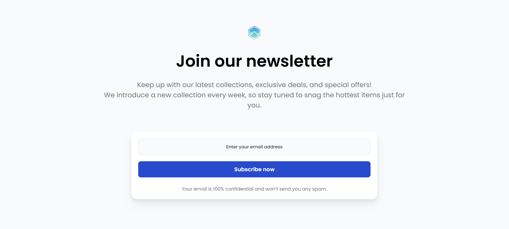

<!-- Please update value in the {}  -->

<h1 align="center">Join Our Newsletter - simple page | devChallenges</h1>

   Solution for a challenge <a href="https://devchallenges.io/challenge/join-our-newsletter" target="_blank">Join Our Newsletter</a> from <a href="http://devchallenges.io" target="_blank">devChallenges.io</a>.

  <h3>
    <a href="https://codebyev.github.io/newsletter-page/">
      Demo
    </a>
     | 
    <a href="https://devchallenges.io/challenge/join-our-newsletter">
      Challenge
    </a>
  </h3>

<!-- OVERVIEW -->

## Overview

Challenge by devchallenges.io to create simple "Join our newsletter" page using HTML and CSS.

